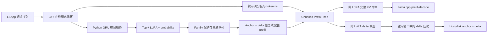

# lora-base-test2 代码结构与实现思路

## 一、当前系统要解决什么问题

这套代码研究的是多 LoRA 场景下的 **prefix KV cache 复用、跨 LoRA KV 压缩和预测预取**。
系统使用 LSApp 的 App 调用轨迹模拟 LoRA 请求序列，并把 87 个 App 一对一映射到 87 个真实
LoRA。请求按到达顺序进入系统，代码在相同 token prefix 上构建分块 prefix tree，并管理每个
prefix 节点在不同 LoRA 下对应的 KV 状态。

当前系统需要严格区分三类行为：

1. **相同 LoRA、相同 prefix 的精确 KV 命中**：可以直接跳过已命中 token 的 prefill，因此直接
   降低当前请求 TTFT。
2. **不同 LoRA、相同 prefix 的 anchor + delta**：不同 LoRA 的完整 KV 不能直接互用，delta 的
   主要作用是压缩 Host/磁盘中的 KV 存储。恢复成目标 LoRA 完整 KV 后，才能参与后续推理。
3. **GRU 预测预取**：只有在下一请求到达前，将预测目标 LoRA 的 KV 准备到 GPU，预测才可能
   间接降低 TTFT。预测本身不会自动产生 prefix 命中。

系统只处理从 prompt 开头开始的 prefix，不处理任意中间 token 的 KV 复用。

## 二、目录结构

```text
examples/lora-base-test2/
├── CMakeLists.txt                 # 定义 llama-lora-base-test2 编译目标
├── lora-base-test2.cpp            # C++ 主程序和全部 KV 系统逻辑
├── gru_online_service.py          # 在线 GRU 服务，维护逐用户历史并返回 Top-k
├── start_gru_service.ps1          # 固定参数启动在线 GRU 服务
├── run_examples.ps1               # Smoke、Prefix、GRU、Delta 实验入口
├── summarize_gru_online.py        # 汇总在线预测准确率、延迟和预取成本
├── test_gru_online_service.py     # GRU 状态和 HTTP 接口测试
├── README.md                      # 快速运行说明
└── 代码结构与实现思路.md          # 本文档
```

编译后生成：

```text
build/bin/Debug/llama-lora-base-test2.exe
```

## 三、整体架构



C++ 负责请求执行、prefix tree、KV 状态、缓存评分和预取决策。Python 只负责根据用户历史预测
下一候选 LoRA，不直接操作 KV cache。

## 四、C++ 主文件的阅读顺序

文件：[lora-base-test2.cpp](./lora-base-test2.cpp)

| 顺序 | 代码入口 | 当前行号 | 作用 |
|---:|---|---:|---|
| 1 | `experiment_options` | 53 | 模型、缓存、delta、预测和 family 评分参数 |
| 2 | `lora_runtime` | 458 | 一个真实 LoRA 的 ID、group、路径和 adapter 指针 |
| 3 | `dataset_request` | 469 | 一条 App/LoRA 请求及 prompt、用户、会话、到达时间 |
| 4 | `tokenized_request` | 507 | prefix、suffix 和提示词分区的 token 边界 |
| 5 | `online_result` | 564 | 每请求 TTFT、命中、预测、delta、存储等指标 |
| 6 | `prefix_variant` | 673 | 同一 prefix 在一个 LoRA 下的 KV 状态 |
| 7 | `prefix_node` | 693 | Prefix tree 节点、父节点、chunk 和多个 LoRA variant |
| 8 | `tokenize_request` | 1051 | 将 prompt 划分为共享 prefix 和请求 suffix |
| 9 | `run_delta_experiment` | 1272 | 独立离线 KV 相似度与 Q8 delta 探测 |
| 10 | `run_online_experiment` | 1661 | 旧版非分块 prefix 基线 |
| 11 | `family_value` | 2224 | Anchor family 的统一价值评分 |
| 12 | `ensure_cache_capacity_v2` | 2369 | 容量不足时进行 family 降级或淘汰 |
| 13 | `ensure_chunk_path` | 2450 | 按 token chunk 逐级查找或创建 prefix tree |
| 14 | `restore_variant_v2` | 2493 | 从 GPU full、Host full 或 Host delta 恢复目标 KV |
| 15 | `convert_variant_to_host_delta` | 2555 | 将目标 KV 压缩成相对 anchor 的 Q8 delta |
| 16 | `prefetch_oracle_chunks` | 2859 | 为预测目标准备 prefix chunk KV |
| 17 | `select_delta_compress_job` | 3072 | 从候选队列选择当前最值得压缩的 family |
| 18 | `run_online_system_v2` | 3103 | 完整请求循环，是当前系统的核心入口 |
| 19 | `save_online_results` | 3648 | 保存在线实验 CSV |
| 20 | `main` | 3904 | 加载模型、87 LoRA、数据并依次运行实验 |

行号会随着代码修改发生变化，因此阅读时应优先搜索函数名。

## 五、核心数据结构

### 1. `dataset_request`

一条请求主要包含：

- `request_id`：请求编号，也是离线预测文件的关联键。
- `user_id`、`session_id`：GRU 用户状态和会话信息。
- `app_name`、`lora_id`：App 与真实 LoRA 的映射结果。
- `arrival_ms`：系统模拟的请求到达时间。
- `original_timestamp`：未缩放的原始时间，用于 GRU 时间特征。
- `prefix_segments`：公共 system 和用户上下文等显式提示词分区。
- `prompt`、`common_prefix_text`：完整输入和可进入树的共享前缀。

### 2. `prefix_node`

一个节点不是单个 token，而是从根到当前 chunk 的完整 prefix 状态。主要字段包括：

- `parent_node_id`：上一级 prefix 节点。
- `prefix_tokens`：从根到当前节点的完整 token 序列。
- `chunk_begin/chunk_end`：当前 chunk 在 prefix 中的范围。
- `segment_kind`：当前块属于 shared system 还是 user context。
- `anchor_lora_id`：该节点使用的 anchor LoRA。
- `variants`：这个 prefix 在不同 LoRA 下的 KV 状态。

### 3. `prefix_variant`

`prefix_variant` 表示“某个 prefix 节点 + 某个 LoRA”的 KV。`residency` 有三种状态：

```text
gpu_full  : GPU 中有可直接使用的完整目标 KV
host_full : Host 中保存完整 KV，需要恢复到 GPU
host_delta: Host 中保存相对 anchor 的 Q8 delta，需要重建目标 KV
```

它还记录访问次数、EMA 调用频率、最近访问位置、预测概率、存储字节、重建误差和恢复成本。

## 六、提示词分区和 Chunked Prefix Tree

### 1. 当前固定分区

当前数据集显式将 prompt 分为：

```text
shared_system -> user_context -> task suffix
```

- `shared_system` 默认每 64 token 切为一个 chunk。
- `user_context` 默认每 128 token 切为一个 chunk。
- task instruction 作为 suffix，仍参与当前请求正常 prefill，但不建立长期共享节点。

代码通过累积 tokenize 各分区文本计算准确 token 边界，而不是用字符长度估算。

### 2. 建树方式

假设 prefix 被分成三个 chunk：

```text
Root
└── System[0:64]
    └── Context[64:192]
        └── Context[192:320]
```

每个新请求从根开始逐级匹配“父节点 + 当前 chunk”。若 token 内容一致，则沿已有节点继续；
从第一个不同 chunk 开始建立新分支。请求命中越深，可以跳过的 prefill token 越多。

这里借鉴的是 chunked prefill 的分块思想，但当前还不是完整的多请求 prefill/decode 交错调度器，
也没有根据语义或 attention 自适应确定 chunk 边界。

## 七、同 LoRA KV 复用流程

对于当前请求的目标 LoRA，系统从最深 prefix 节点向上查找 `gpu_full` variant：

```text
找到最深目标 LoRA KV
  -> 将缓存序列复制到当前 request sequence
  -> 跳过 hit_depth 之前的 prefill
  -> 只计算剩余 prefix 和 suffix
  -> 更新命中次数、频率和最近访问位置
```

这条路径是真正直接降低 TTFT 的路径。如果树中只有相同文本但不同 LoRA 的 KV，不能直接复制
给当前 LoRA 使用。

## 八、跨 LoRA Delta 生命周期

### 1. 为什么需要 anchor + delta

相同 prefix 在不同 LoRA 下产生的 KV 数值不同。系统选择组内一个 LoRA 作为 anchor，将其他 LoRA
的 KV 表示为：

```text
KV_child ≈ KV_anchor + dequantize(delta_q8)
```

其中 delta 使用 Q8 数值和分块 scale 保存。其目标是减少多份完整 KV 的 Host/磁盘占用。

### 2. 延迟压缩流程

当前采用前台标记、空闲阶段处理：

```text
前台发现：相同 prefix、不同 LoRA、两份完整 KV 已存在
  -> 只加入 delta_compress_job
  -> 当前请求继续完成
请求间存在足够空闲窗口
  -> 按 family 价值选择候选
  -> 验证 anchor 和 child 仍然驻留
  -> 计算并量化 delta
  -> 可选重建质量验证
  -> child 完整 KV 降级为 Host delta
```

如果处理前节点已经淘汰、variant 不再驻留、anchor 缺失、质量不达标或 Host 空间不足，任务会被
跳过并记录原因。因此不是所有候选都应该压缩。

### 3. 持久化 Delta

`--delta-store-policy build|load|auto` 控制磁盘 delta：

- `build`：构建后保存。
- `load`：只读取已有文件。
- `auto`：优先读取，缺失时允许构建并保存。
- `none`：不使用持久化存储。

磁盘读取和 delta 恢复同样属于后台准备成本，不能直接写成“delta 本身降低当前 TTFT”。

## 九、三级缓存状态

当前代码形成的是三级状态原型：

1. **Host/磁盘层**：保存低热度完整 KV、anchor 和压缩 delta。
2. **GPU compact family 层**：保留价值较高的 anchor；相关 delta 当前主要仍在 Host，形成
   “GPU anchor + Host delta”的依赖关系，并不是 delta 全部物理驻留 GPU。
3. **GPU ready 层**：根据预测，将目标 `anchor + delta` 提前恢复成目标 LoRA 的完整 KV，或者
   直接提前执行目标 LoRA prefill。

缓存管理单位不是任意单个 delta，而是一个 anchor family。删除 anchor 后，其依赖 delta 无法独立
恢复，因此换入、保护、降级和淘汰需要考虑整个 family 的依赖关系。

## 十、Anchor Family 量化评分

`family_value()` 将一个 prefix 节点的 anchor 及相关 variants 聚合评分。当前收益项为：

```text
Benefit = Wf * 调用频率
        + Wp * 预测概率
        + Wl * prefix token 长度
        + Wd * delta fanout
        + Wr * 最近访问程度
        + Ws * 提示词分区优先级
```

成本项为：

```text
Cost = Wm * 内存占用
     + Wc * KV 恢复/物化成本
```

最终：

```text
RawScore = Benefit - Cost
```

当 `--family-normalize-by-mb 1` 时，再按 family 占用空间归一化，表示单位 MiB 的价值密度；
关闭时更偏向绝对收益。默认权重都在 `experiment_options` 中，可以置零做消融。

调用频率使用 EMA 衰减。过去很热但长期不再访问的 family 会逐渐降低分数；预测概率只在对应
目标请求到达前有效，请求到达后会过期，避免永久保护错误预测。

## 十一、在线 GRU 预测

### 1. 为什么使用独立 Python 服务

原 checkpoint 是 PyTorch 模型。为了避免在当前 llama.cpp 中引入 LibTorch/ONNX Runtime，系统
将预测与 KV 管理解耦：

```text
C++ llama.cpp
  -> POST /predict: user_id + 当前 lora_id + 原始时间
Python GRU 服务
  -> 更新该用户最近 15 条历史
  -> 返回 Top-k lora_id 和 probability
C++
  -> 保护对应 family
  -> 根据空闲时间、缓存状态和成本决定是否真正预取
```

GRU 模型仍然是离线训练，但 `service` 模式是在线推理。服务不是读取未来答案，而是在当前请求
完成后只使用该用户截至当前时刻的历史预测下一条请求。

### 2. 用户状态

服务按 `user_id` 隔离状态，每个用户保存：

- 最近 15 个 App ID。
- 每次调用的小时正弦/余弦特征。
- 与前一次调用的时间差 `log1p(delta_seconds)`。
- 最近处理的 `request_id`，用于防止 HTTP 重试重复追加。

历史少于 15 条时返回 `ready=false`，这是 GRU 冷启动期。不同用户不会共享历史窗口。

### 3. HTTP 接口

- `GET /health`：检查模型、设备和当前用户数。
- `GET /state`：查看用户数和累计事件数。
- `POST /reset`：清空所有用户历史，每轮实验开始前调用。
- `POST /predict`：更新当前用户状态并返回下一 LoRA 的 Top-k。

C++ 使用 `--prefetch-policy service` 启用在线服务。服务超时或返回错误时，本次跳过预测预取，
前台 LLM 请求继续执行。预测查询耗时会从可用后台空闲窗口中扣除。

### 4. `file` 与 `service` 的区别

| 模式 | 数据来源 | 是否实时更新用户状态 | 主要用途 |
|---|---|---:|---|
| `file` | 预生成 JSONL | 否 | 固定轨迹复现、可重复对照 |
| `service` | Python GRU HTTP 服务 | 是 | 在线用户状态和真实通信开销 |
| `oracle` | 直接读取下一条真实 LoRA | 不需要 | 测量预测收益理论上限 |

在线输出记录 Top-k、下一条真实 LoRA、Top-1/Top-k 命中、HTTP 总延迟和模型推理延迟，可直接
计算预测准确率与服务开销。

## 十二、一次请求在 `run_online_system_v2` 中的完整流程

```text
1. 读取当前 dataset_request
2. 绑定已加载的当前 LoRA adapter，tokenize prompt
3. 按 system/context chunk 查找或创建 prefix path
4. 为前台请求预留 KV 容量，必要时降级低价值 family
5. 从最深节点向上查找当前 LoRA 的 gpu_full KV
6. 命中则恢复缓存；未命中则正常计算 prefix
7. 计算 suffix 和首 token，得到 TTFT
8. 将本次新产生的跨 LoRA KV 标记为 delta 候选
9. 调用 GRU 服务，用当前请求预测下一 LoRA
10. 根据 Top-k 概率保护 family，并创建预取任务
11. 计算当前请求到下一请求之间剩余的逻辑空闲时间
12. 在预算允许时执行预取任务
13. 在剩余预算允许时执行最高价值 delta 压缩任务
14. 更新三级缓存、内存和后台队列指标
15. 将本请求结果写入 online_result
```

当前“后台”由同一线程在请求间空闲窗口中模拟，不是真正并发的后台线程或 CUDA stream。因此
代码可以验证策略、工作量和是否超过时间预算，但不能直接代表最终异步系统的并行性能。

## 十三、Main 的实验组织

`main()` 的顺序是：

```text
加载参数和数据
  -> 加载基座模型
  -> 加载 87 个 LoRA adapter
  -> 运行离线 delta probe
  -> 运行完整 prompt baseline
  -> 运行 legacy 或 system-v2 在线实验
  -> 保存 CSV
  -> 释放 LoRA 和模型
```

设置 `--max-online-requests 120` 时，输出通常包含约 120 条 `baseline` 和 120 条 `online`，所以
日志可能显示 `online_rows=240`。这是为了按相同请求配对比较，不是数据被错误执行了两次。

## 十四、主要输出文件

| 文件 | 内容 |
|---|---|
| `delta_prefix_probe.csv` | 每个 LoRA pair 的 KV cosine、L2、delta 大小和构建成本 |
| `delta_prefix_layers.csv` | 每层 K/V 的 cosine 和 L2 |
| `online_request_results.csv` | Baseline 与 online 每请求 TTFT、命中、预测、预取和存储指标 |
| `online_prefix_tree.csv` | 最终 prefix tree、variant residency 和 family 状态 |
| `family_cache_events.csv` | Family 降级/淘汰原因、收益项、成本项和最终分数 |
| `system_parameters.csv` | 本轮模型、LoRA、缓存上限、GRU 服务和评分参数 |
| `gru_service_predictions.jsonl` | Python 服务逐次返回的完整 Top-k 日志 |
| `gru_online_summary.json` | 在线预测准确率、通信延迟、TTFT 和后台成本汇总 |

## 十五、建议运行顺序

### 1. GRU 状态测试

```powershell
D:\anaconda\envs\qwen2.5_vl\python.exe D:\ecnu_experiment\LLama.cpp\llama.cpp\examples\lora-base-test2\test_gru_online_service.py
```

### 2. 启动在线 GRU

```powershell
powershell -ExecutionPolicy Bypass -File D:\ecnu_experiment\LLama.cpp\llama.cpp\examples\lora-base-test2\start_gru_service.ps1
```

### 3. 检查服务

```powershell
Invoke-RestMethod http://127.0.0.1:8765/health
```

### 4. C++ Smoke

```powershell
powershell -ExecutionPolicy Bypass -File D:\ecnu_experiment\LLama.cpp\llama.cpp\examples\lora-base-test2\run_examples.ps1 -Case Smoke
```

### 5. Prefix-only 基线

```powershell
powershell -ExecutionPolicy Bypass -File D:\ecnu_experiment\LLama.cpp\llama.cpp\examples\lora-base-test2\run_examples.ps1 -Case PrefixOnly -Requests 120
```

### 6. 在线 GRU 完整策略

```powershell
powershell -ExecutionPolicy Bypass -File D:\ecnu_experiment\LLama.cpp\llama.cpp\examples\lora-base-test2\run_examples.ps1 -Case GruOnline -Requests 120
```

### 7. 汇总结果

```powershell
D:\anaconda\envs\qwen2.5_vl\python.exe D:\ecnu_experiment\LLama.cpp\llama.cpp\examples\lora-base-test2\summarize_gru_online.py D:\ecnu_experiment\LLama.cpp\llama.cpp\examples\lora-base-test2\output_gru_online
```

## 十六、当前实现边界

已经完成：

- 87 App 到 87 真实 LoRA 的映射和顺序重放。
- 固定提示词分区和 chunked prefix tree。
- 相同 LoRA exact prefix KV 命中。
- 跨 LoRA Q8 anchor + delta 压缩和质量验证。
- 前台标记、空闲窗口延迟压缩和持久化 delta store。
- Host full、Host delta、GPU full 三级状态原型。
- Anchor family 调用频率、预测概率、热度、依赖和成本评分。
- JSONL 离线对照与 Python GRU 在线逐用户预测。
- 预测保护、Top-k 预取和完整实验指标。

尚未完成：

- 真正独立后台线程和 CUDA stream。
- 动态 LoRA 权重换入换出。
- GPU 上完整的 compact delta 物理缓存层。
- 语义边界或 attention 驱动的自适应 prompt 切分。
- 增量 chunk delta，当前部分路径仍需要较完整的 KV 操作。
- GRU + 聚类 + 全局关系表 + 用户关系表的完整融合预测。
- 一个 App 对应多个 LoRA 的分层预测。
- 当前 prefix 系统中的 mixed-LoRA batch 和 fused CUDA kernel。
- 任意中间 token KV 复用。

因此，当前代码应描述为“可运行的系统策略原型”，不能直接描述为已经完成全部并发和端侧部署
优化的最终生产系统。

## 十七、统一消融实验代码

[run_system_ablations.ps1](./run_system_ablations.ps1) 将汇报中的功能组织成五组可重复实验：

| Suite | Case | 主要回答的问题 |
|---|---|---|
| `PrefixDelta` | `prefix_only`、`deferred_delta` | Prefix 命中与延迟 delta 分别产生什么收益和成本 |
| `Prediction` | `no_prediction`、`gru_file`、`gru_online`、`oracle` | 固定 GRU、在线 GRU 与 Oracle 的预测收益和浪费 |
| `Storage` | `gpu_exact_only`、`gpu_plus_host_full`、`host_anchor_delta`、`gru_gpu_ready` | 逐步开启 Host full、delta 和预测 ready 状态后的变化 |
| `Family` | `recency`、`frequency`、`frequency_recency`、`frequency_prediction`、`full_latency`、`full_density` | 调用频率、预测和成本项对 family 管理的作用 |
| `Grouping` | `random`、`semantic`、`transition`、`hybrid` | 不同分组目标对 KV delta 和在线局部性的影响 |

先只检查命令，不运行模型：

```powershell
powershell -ExecutionPolicy Bypass -File D:\ecnu_experiment\LLama.cpp\llama.cpp\examples\lora-base-test2\run_system_ablations.ps1 -Suite All -Requests 12 -DeltaPairs 4 -DryRun
```

运行一组 prefix/delta 消融：

```powershell
powershell -ExecutionPolicy Bypass -File D:\ecnu_experiment\LLama.cpp\llama.cpp\examples\lora-base-test2\run_system_ablations.ps1 -Suite PrefixDelta -Requests 120
```

只运行一个 case：

```powershell
powershell -ExecutionPolicy Bypass -File D:\ecnu_experiment\LLama.cpp\llama.cpp\examples\lora-base-test2\run_system_ablations.ps1 -Suite Prediction -Case gru_online -Requests 120
```

`gru_online` 和 `gru_gpu_ready` 运行前必须启动 `start_gru_service.ps1`。其他 case 不需要在线
GRU 服务。

运行完后统一汇总：

```powershell
D:\anaconda\envs\qwen2.5_vl\python.exe D:\ecnu_experiment\LLama.cpp\llama.cpp\examples\lora-base-test2\analyze_system_ablations.py
```

汇总程序生成 `system_ablation_summary.csv/json`，包含 TTFT、prefix 命中、Host full/delta 峰值、
delta 压缩率、后台工作量、预测准确率、GRU 延迟和离线 KV 相似度。

汇总中 `full_prefix_hit_rate` 表示整个共享 prefix 全命中；`any_chunk_prefix_hit_rate` 表示至少
命中一个 chunk。汇报“prefix 命中率”时需要明确使用哪一个，不能将部分命中当成完整命中。

需要注意，`Storage` 是当前原型中的逻辑状态消融。它可以比较“只有 GPU exact”“允许 Host
full”“允许 Host delta”“允许预测 ready”四种能力，但还不能证明存在一个已经完全物理隔离并
异步迁移的 GPU compact-delta 池。
