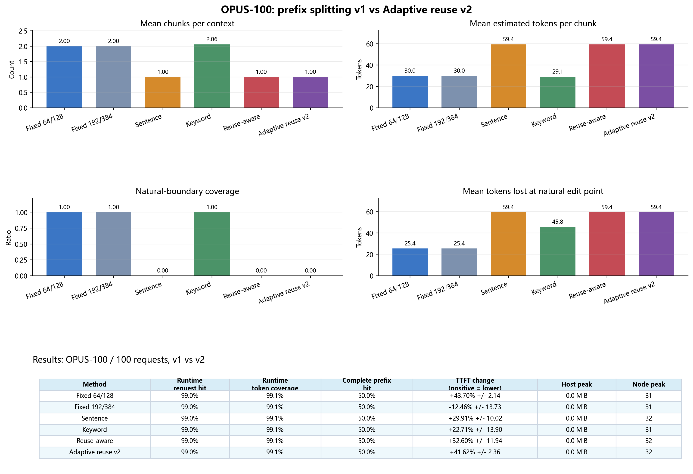

# OPUS-100 prefix splitting comparison 2

- Requests: `100` for this comparison output.
- Methods: the original five v1 methods plus `Adaptive reuse v2`.
- Positive TTFT change means lower online TTFT than the matched full-prefill baseline.
- v2 score: `abs(chunk_tokens - target) + 10 * future_nodes + 80 * prefetch_overflow - reuse_weight * reuse_boundary - 18 * natural_boundary`.
- `reuse_weight = 48 + 64 * context_reaccess_rate + 64 * exact_prefix_rate`; v2 therefore adapts to workload reuse instead of using the v1 fixed bonus 72.

| Method | Runtime request hit | Runtime token coverage | Complete prefix hit | TTFT change | Host peak | Node peak | Mean chunks | Mean tokens/chunk |
|---|---:|---:|---:|---:|---:|---:|---:|---:|
| Fixed 64/128 | 99.0% | 99.1% | 50.0% | +43.70% +/- 2.14 | 0.0 MiB | 31 | 2.00 | 30.0 |
| Fixed 192/384 | 99.0% | 99.1% | 50.0% | -12.46% +/- 13.73 | 0.0 MiB | 31 | 2.00 | 30.0 |
| Sentence | 99.0% | 99.1% | 50.0% | +29.91% +/- 10.02 | 0.0 MiB | 32 | 1.00 | 59.4 |
| Keyword | 99.0% | 99.1% | 50.0% | +22.71% +/- 13.90 | 0.0 MiB | 31 | 2.06 | 29.1 |
| Reuse-aware | 99.0% | 99.1% | 50.0% | +32.60% +/- 11.94 | 0.0 MiB | 32 | 1.00 | 59.4 |
| Adaptive reuse v2 | 99.0% | 99.1% | 50.0% | +41.62% +/- 2.36 | 0.0 MiB | 32 | 1.00 | 59.4 |

## v2 interpretation

- v2 is designed to reduce chunk count when context reaccess is sparse, align with historical reuse points when reaccess is frequent, and fit long parallel prefixes into the two-chunk prefetch budget.
- The v2 row is not a claim that all negative TTFT disappears: long cross-LoRA prefixes can still pay KV materialization and uncached suffix cost.
- Compare this report with the original report in `../all_prefix_5/` or `../opus100_prefix_100/`; the old outputs are intentionally unchanged.
