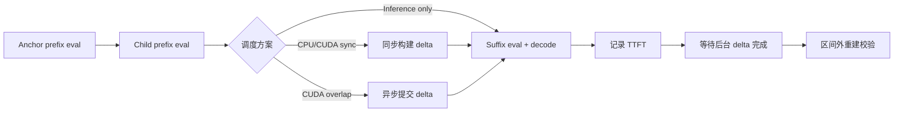

# KV Delta 构建与 Suffix 推理调度实验

> **摘要：** GPU 同步构建 delta 已基本消除 CPU 路径的巨大延迟；CUDA overlap 可将 TTFT 从 28.58 ms 降至 25.37 ms，但会把端到端完成时间提高到 33.65 ms。因此，当前 overlap 更适合“优先返回首 token”的场景，而不是追求最低总耗时。

## 1. 研究问题

本实验研究 KV delta 构建与 child suffix 推理的调度关系，重点回答以下问题：

1. CPU 和 CUDA 构建 delta 的延迟差异有多大？
2. delta 与 suffix 推理重叠能否缩短 TTFT？
3. TTFT 收益是否会转化为端到端总耗时收益？
4. Q8 delta 能节省多少 KV 空间，重建误差是否可接受？

实验只讨论 GPU 常驻 KV 的在线压缩与调度，不包含磁盘或主存换入换出。

## 2. 实验设计

### 2.1 四种对比方案

| 方案 | 执行流程 | 对比意义 |
| --- | --- | --- |
| `inference-only` | child suffix eval + 一次 decode，不构建 delta | 纯推理基线 |
| `cpu-sync` | CPU 同步构建 delta，完成后执行 suffix 推理 | 原始 CPU 压缩路径 |
| `cuda-sync` | CUDA 同步构建 delta，完成后执行 suffix 推理 | GPU 压缩、无重叠 |
| `cuda-overlap` | 低优先级 CUDA stream 构建 delta，同时执行 suffix 推理；首 token 后等待 delta 完成 | GPU 压缩、流级重叠 |

`cuda-overlap` 是 CUDA stream 级调度，不是把完整推理图和 delta 合并为一个 kernel。llama.cpp 推理由多个 ggml、cuBLAS 和 FlashAttention kernel 组成，当前实现是在不改变推理图结构的前提下重叠执行。

### 2.2 实验流程



### 2.3 环境与参数

| 项目 | 配置 |
| --- | --- |
| GPU | NVIDIA GeForce RTX 2080 Ti，约 22.5 GiB VRAM |
| 模型 | Qwen2.5-1.5B-Instruct F16 GGUF |
| Workload | `mobilora_workloads_87_original` |
| Delta pairs | 4 对 |
| Common prefix | 508 tokens |
| Repeats | 3 次，每种方案 12 条记录 |
| 总记录数 | 48 |
| Suffix | 4 tokens |
| Context | `n_ctx=2048` |
| Batch | `n_batch=128`，`n_ubatch=32` |
| Prefix chunk | 64 |
| GPU layers | 99 |
| Decode | 1 token |

四种方案使用相同 delta pair、LoRA、prefix、suffix 和上下文参数，避免输入差异影响比较。

## 3. 计时与正确性指标

### 3.1 计时边界

Anchor prefix eval 和 child prefix eval 用于预先建立两份完整 KV，不计入本次调度延迟。

- **TTFT：** 从 `measured_start` 到第一个 decode 完成。
- **Total：** 从 `measured_start` 到本次前台推理以及必要的后台 delta 收尾完成。
- **Foreground：** suffix eval 与 decode 的前台执行时间。
- **Visible delta：** 同步构建耗时，或 overlap 模式中的 submit 与 finish wait 之和。

三种 delta 模式在测量区间之前保留 KV probe 作为同步点；`inference-only` 不执行 probe。重建 materialize 与 reconstruction probe 均在计时区间之外，因此不会污染 TTFT 和 Total。

### 3.2 正确性指标

- KV 逻辑节省率
- 重建 cosine similarity
- 重建 L2 error
- delta 构建和重建是否成功

## 4. 延迟结果


*图 1：左图显示四方案总体延迟，CPU delta 构建明显成为瓶颈；右图放大纯推理与两种 CUDA 方案，便于比较 TTFT 与 Total。*

| 方案 | Visible delta (ms) | TTFT (ms) | Total (ms) | 状态 |
| --- | ---: | ---: | ---: | --- |
| `inference-only` | 0.00 | 29.04 | 29.04 | 12/12 ok |
| `cpu-sync` | 619.78 | 642.72 | 642.72 | 12/12 ok |
| `cuda-sync` | 5.78 | 28.58 | 28.58 | 12/12 ok |
| `cuda-overlap` | 10.86 | 25.37 | 33.65 | 12/12 ok |

### 4.1 CPU 与 CUDA delta

`cpu-sync` 相比纯推理基线增加约 **613.69 ms**。这说明当前 CPU delta 构建成本远高于 suffix 推理本身，不适合在线请求路径。

`cuda-sync` 的 TTFT 为 **28.58 ms**，与纯推理基线 **29.04 ms** 基本相当。均值上的 -0.46 ms 差异小于当前实验的 warm-up 和执行顺序扰动，不能解释为 delta 构建使推理变快。

### 4.2 CUDA overlap 的收益与代价

相对 `cuda-sync`：

- TTFT 减少 **3.21 ms**，下降约 **11.2%**。
- Total 增加 **5.07 ms**，上升约 **17.7%**。
- 首 token 返回后仍有约 **8.28 ms** 的 delta finish wait。

因此，overlap 成功隐藏了部分 delta 时间并提前返回首 token，但没有降低整个请求与 delta 工作全部结束的时间。

## 5. 压缩与重建结果


*图 2：Q8 delta 将平均 KV 存储从 13.89 MiB 降至 7.05 MiB；右图使用对数坐标展示重建误差。*

| 指标 | 结果 |
| --- | ---: |
| 完整 KV 等效大小 | 14,565,376 bytes / 13.89 MiB |
| Q8 delta + scale | 7,396,480 bytes / 7.05 MiB |
| KV 节省率 | 49.21875% |
| 重建有效 | 36/36 |
| 最低 cosine | 0.9999981088 |
| 最大 L2 | 0.0019988342 |

三种 delta 调度方式得到相同的逻辑存储节省率，且所有重建样本均通过校验。`inference-only` 不生成 delta，其压缩和重建指标为 N/A，而不是失败。

## 6. 结论

1. **CPU delta 不适合在线关键路径。** 其构建耗时约 620 ms，是当前实验的主要瓶颈。
2. **CUDA 同步构建是更稳妥的默认方案。** 它保留 49.22% KV 节省，同时端到端延迟接近纯推理基线。
3. **CUDA overlap 优化的是 TTFT，不是总耗时。** 它适合优先向用户返回首 token、允许后台继续完成压缩的服务场景。
4. **当前证据支持流级重叠，但不支持“单 kernel 融合”结论。** 是否进一步融合需要重新设计推理图和 delta 数据依赖。

## 7. 有效性限制

- 四种模式当前按固定顺序执行，均值可能受到 GPU warm-up、温度和缓存状态影响。
- 每种模式只有 12 条记录，适合验证实现方向，但不足以给出稳定的生产级尾延迟结论。
- overlap 的 `delta_ms` 是 host 可见 submit 与 finish wait，不等于 delta kernel 的完整 GPU 墙钟时间。
- 当前只验证 508-token prefix、4-token suffix 和单一模型配置。
- KV cosine/L2 只说明数值重建接近，还需要生成一致性、任务准确率或 perplexity 实验。

## 8. 后续实验建议

1. 按 pair/repeat 交错或随机化四种方案，并加入独立 warm-up。
2. 增加 prefix 长度、suffix 长度、batch 和并发请求数的参数扫描。
3. 使用 CUDA event 记录 delta 完整 GPU 时间、被推理隐藏的时间和 finish wait。
4. 统计 P50、P95、P99 TTFT 与 Total，而不只比较均值。
5. 增加生成 token 一致性、准确率和 perplexity 测试。

## 9. 复现实验

```powershell
build\bin\Release\llama-lora-base-test5.exe `
  --max-pairs 4 `
  --repeats 3 `
  --n-ctx 2048 `
  --n-batch 128 `
  --n-ubatch 32 `
  --prefix-chunk 64 `
  --suffix-tokens 4 `
  --output-dir examples/lora-base-test5/output/final-4modes-4pairs-3repeats-v2

python examples/lora-base-test5/output/final-4modes-4pairs-3repeats-v2/plot_experiment_results.py
```

相关文件：

- 原始结果：[`fused_delta_results.csv`](./fused_delta_results.csv)
- 汇总结果：[`fused_delta_summary.csv`](./fused_delta_summary.csv)
- 绘图脚本：[`plot_experiment_results.py`](./plot_experiment_results.py)
- 交互式可视化：`C:/Users/17363/.codex/visualizations/2026/08/10/019fe9d7-27d9-72e3-a06d-a258d203d17f/kv-delta-scheduling-comparison.html`
